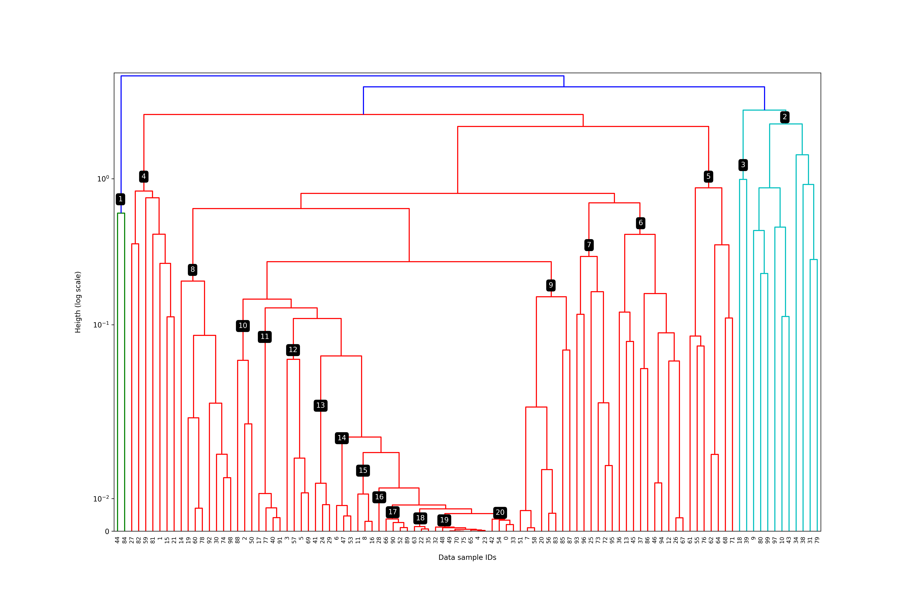

Cutting dendrograms to achieve hierarchical clustering with balanced cluster sizes.

# Abstract

Hierarchical (a.k.a. agglomerative) linkage techniques are common in a wide range of fields such as economics, bioinformatics, (`some fields`). The output of these techniques are dendrograms, which are directed acylic graphs (`note: not just DAGs - they have tree structure`) that define the linkage between input data. Generating clusters requires some method of cutting the dendrogram to separate groups of points from each other. Many existing cutting techniques, such as a straight cut along a constant height, lead to clusters with highly imbalanced sizes. This paper presents and demonstrates balancedCut for Python - a method of cutting dendrograms with balanced cluster sizes.

# Introduction

- What is hierarchical clustering, dendrogram, tree cut.

- Straight cut (i.e. constant height cut).

{#fig:straightCut}

- hdbscan: @mcinnes2017hdbscan, dynamicTreeCut @langfelder2008defining

- High-dimensional data have reduced contrast @beyer1999nearest, and often high 'hubness' @radovanovic2010hubs, as a result of curse of dimensionality. In these cases, similarity by usual distance metrics is not well defined. Single-linkage, Ward linkage, or other linkages may result in dendrograms that are impossible to cut while preserving underlying structure. In these cases, variable cutting distance is required.

- Example of hubness causing bad hierarchical clustering results: @maccuish2001ties
 
(a reference to the abstract: [Abstract](#abstract)).

# Algorithm and Results

[algorithm explanation]

{#fig:balancedCut}

# References